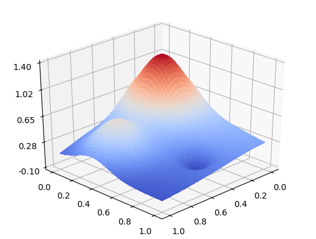
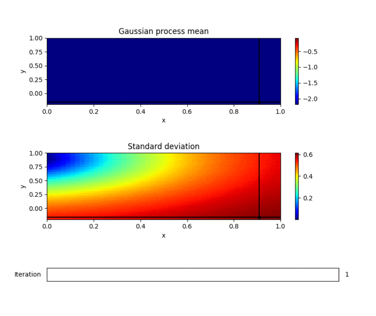

OccamBayesian 
&middot;
[](https://www.repostatus.org/#wip) [](https://app.codacy.com/app/mortele/OccamBayesian?utm_source=github.com&utm_medium=referral&utm_content=mortele/OccamBayesian&utm_campaign=Badge_Grade_Dashboard)
=========

Bayesian optimization applied to OCCAM hybrid particle-field simulations, built on top of [fmfn/BayesianOptimization](https://github.com/fmfn/BayesianOptimization).

Dependencies
---------
Install the [BayesianOptimization](https://github.com/fmfn/BayesianOptimization) package and the [file_read_backwards](https://file-read-backwards.readthedocs.io/en/latest/readme.html) package by
```bash
> pip3 install bayesian-optimization
> pip3 install file_read_backwards
```

Simple usage
---------
Set the `OCCAM_PATH` in `occam_bayesian.py` to wherever the OCCAM executable is located, and run
```bash
> python3 occam_bayesian.py
```

2D optimization example 
---------
By default, the `occam_bayesian_2d.py` script uses Franke's bivariate test function<sup>[1](#myfootnote1)</sup>, described as

> "This surface consists of two Gaussian peaks and a sharper Gaussian dip superimposed on a surface sloping toward the first quadrant. The latter was included mainly to enhance the visual aspects of the surface (...)"
> 

Running `occam_bayesian_2d.py` runs a series of optimization steps, with a default of 10 initial (random) ones before the Gaussian process is used for subsequent point suggestions. 
```bash
> python3 occam_bayesian_2d.py 

Logging to logfile:  /current/working/directory/logs/log_0.json

|   iter    |  target   |     x     |     y     |
-------------------------------------------------
|  1        | -1.84     |  0.9081   | -0.1615   |
|  2        | -0.5958   |  0.1638   | -0.1437   |
|  3        | -1.052    |  0.8944   |  0.3331   |
|  4        | -0.3604   |  0.1154   |  0.03668  |
|  5        | -1.367    |  0.09501  |  0.7301   |
|  6        | -1.403    |  0.1466   |  0.739    |
|  7        | -1.722    |  0.8219   | -0.1401   |
|  8        | -1.733    |  0.8275   | -0.1042   |
|  9        | -1.011    |  0.4294   |  0.4017   |
|  10       | -1.677    |  0.9369   |  0.1053   |
=================================================

|   iter    |  target   |     x     |     y     |
-------------------------------------------------
|  11       | -2.144    |  1.0      |  1.0      |
|  12       | -0.5517   |  0.0      | -0.0719   |
```

Subsequent runs will continue where this left off, by loading any files found in the current working directory, or the `logs/` directory (relative to the current working directory). 

```bash
> python3 occam_bayesian_2d.py

Logging to logfile:  /current/working/directory/logs/log_1.json
Loading previous runs from logfile(s):
/current/working/directory/logs/log_0.json
 
                       ...

|   iter    |  target   |     x     |     y     |
-------------------------------------------------
|  13       | -0.5076   |  0.0      |  0.2673   |
|  14       | -0.1863   |  0.257    |  0.1143   |
```

The optimization process can be visualized by running the `plot_logs.py` script. By default, this attempts to find logs in the current working directory {or if that fails, the relative `logs/` directory}). You can also specify a directory to look for log files manually on the command line, i.e.
```bash
> python3 plot_logs.py path/to/logs
```
> 

The plot shows the mean of the Gaussian process (top) and the standard deviation (bottom), with the actual measurements indicated as black dots. The last performed measurement is given by the cross hairs. It is possible to inspect the optimization during any iteration, using the slider at the bottom.

----
<a name="myfootnote1">1</a>: Franke, Richard. *A critical comparison of some methods for interpolation of scattered data*. Monterey, California: Naval Postgraduate School, 1979.